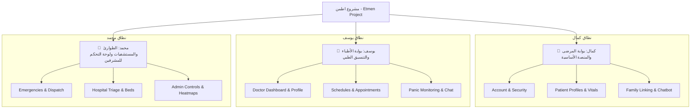

# 🏥 دليل تقسيم العمل على الكنترولرات لتجنب التضارب (Controller Division Plan)

يركز هذا الدليل على تقسيم الـ **24 Controllers** الموجودة في مشروع **Etmen** الطبي على المطورين الثلاثة: **كمال (Kamal)**، **يوسف (Yousef)**، و**محمد (Muhammed)**. يهدف هذا التقسيم إلى ضمان عدم تداخل المهام وتجنب تعارضات الدمج (Git Merge Conflicts) أثناء التطوير في طبقة العرض (Presentation Layer) وطبقة الخدمات (BLL).

---

## 🗺️ مخطط توزيع المهام العام (Task Distribution Map)

---

## 📊 جدول التوزيع العام للكنترولرات (General Distribution Table)

| المطور | النطاق الأساسي | عدد الكنترولرات | ملفات الكنترولرات (Controllers) |
| :--- | :--- | :---: | :--- |
| **كمال (Kamal)** | حسابات المستخدمين، لوحة تحكم وتفاصيل المرضى، الربط العائلي، الذكاء الاصطناعي للمريض | **7** | [AccountController](file:///c:/Users/Kozmo0_2/source/repos/Etmen_DEPI_Project-ElSherka/Etmen_PL/Controllers/AccountController.cs) [HomeController](file:///c:/Users/Kozmo0_2/source/repos/Etmen_DEPI_Project-ElSherka/Etmen_PL/Controllers/HomeController.cs) [PatientDashboardController](file:///c:/Users/Kozmo0_2/source/repos/Etmen_DEPI_Project-ElSherka/Etmen_PL/Controllers/PatientDashboardController.cs) [PatientProfileController](file:///c:/Users/Kozmo0_2/source/repos/Etmen_DEPI_Project-ElSherka/Etmen_PL/Controllers/PatientProfileController.cs) [FamilyLinkingController](file:///c:/Users/Kozmo0_2/source/repos/Etmen_DEPI_Project-ElSherka/Etmen_PL/Controllers/FamilyLinkingController.cs) [LabResultsController](file:///c:/Users/Kozmo0_2/source/repos/Etmen_DEPI_Project-ElSherka/Etmen_PL/Controllers/LabResultsController.cs) [ChatbotController](file:///c:/Users/Kozmo0_2/source/repos/Etmen_DEPI_Project-ElSherka/Etmen_PL/Controllers/ChatbotController.cs) |
| **يوسف (Yousef)** | حسابات الأطباء، جدولة المواعيد، السجلات الطبية، المحادثات المشتركة، صندوق حالات الذعر الطارئة | **8** | [DoctorDashboardController](file:///c:/Users/Kozmo0_2/source/repos/Etmen_DEPI_Project-ElSherka/Etmen_PL/Controllers/DoctorDashboardController.cs) [DoctorProfileController](file:///c:/Users/Kozmo0_2/source/repos/Etmen_DEPI_Project-ElSherka/Etmen_PL/Controllers/DoctorProfileController.cs) [DoctorSlotsController](file:///c:/Users/Kozmo0_2/source/repos/Etmen_DEPI_Project-ElSherka/Etmen_PL/Controllers/DoctorSlotsController.cs) [DoctorAppointmentsController](file:///c:/Users/Kozmo0_2/source/repos/Etmen_DEPI_Project-ElSherka/Etmen_PL/Controllers/DoctorAppointmentsController.cs) [DoctorPatientsController](file:///c:/Users/Kozmo0_2/source/repos/Etmen_DEPI_Project-ElSherka/Etmen_PL/Controllers/DoctorPatientsController.cs) [DoctorPanicInboxController](file:///c:/Users/Kozmo0_2/source/repos/Etmen_DEPI_Project-ElSherka/Etmen_PL/Controllers/DoctorPanicInboxController.cs) [ChatController](file:///c:/Users/Kozmo0_2/source/repos/Etmen_DEPI_Project-ElSherka/Etmen_PL/Controllers/ChatController.cs) [MedicalRecordsController](file:///c:/Users/Kozmo0_2/source/repos/Etmen_DEPI_Project-ElSherka/Etmen_PL/Controllers/MedicalRecordsController.cs) |
| **محمد (Muhammed)** | إدارة الطوارئ، غرف الطوارئ بالمستشفيات، لوحة تحكم المسؤول (Admin Dashboard)، تقييم المخاطر، إدارة الأزمات | **9** | [EmergencyController](file:///c:/Users/Kozmo0_2/source/repos/Etmen_DEPI_Project-ElSherka/Etmen_PL/Controllers/EmergencyController.cs) [HospitalQueueController](file:///c:/Users/Kozmo0_2/source/repos/Etmen_DEPI_Project-ElSherka/Etmen_PL/Controllers/HospitalQueueController.cs) [RiskAssessmentController](file:///c:/Users/Kozmo0_2/source/repos/Etmen_DEPI_Project-ElSherka/Etmen_PL/Controllers/RiskAssessmentController.cs) [NearbyProvidersController](file:///c:/Users/Kozmo0_2/source/repos/Etmen_DEPI_Project-ElSherka/Etmen_PL/Controllers/NearbyProvidersController.cs) [AdminDashboardController](file:///c:/Users/Kozmo0_2/source/repos/Etmen_DEPI_Project-ElSherka/Etmen_PL/Controllers/AdminDashboardController.cs) [AdminUsersController](file:///c:/Users/Kozmo0_2/source/repos/Etmen_DEPI_Project-ElSherka/Etmen_PL/Controllers/AdminUsersController.cs) [AdminProvidersController](file:///c:/Users/Kozmo0_2/source/repos/Etmen_DEPI_Project-ElSherka/Etmen_PL/Controllers/AdminProvidersController.cs) [AdminReportsController](file:///c:/Users/Kozmo0_2/source/repos/Etmen_DEPI_Project-ElSherka/Etmen_PL/Controllers/AdminReportsController.cs) [AdminCrisisController](file:///c:/Users/Kozmo0_2/source/repos/Etmen_DEPI_Project-ElSherka/Etmen_PL/Controllers/AdminCrisisController.cs) |

---

## 👤 تفاصيل المهام لكل مطور (Detailed Scope breakdown)

### 1. كمال (Kamal) - بوابة المرضى والمنصة الأساسية
يركز كمال على أول نقطة تفاعل للمستخدمين (الدخول والتسجيل) وواجهة المريض الكاملة لضمان تجربة مستخدم سلسلة للمرضى.

> [!NOTE]
> جميع الواجهات المطلوبة لكمال يجب أن تنشأ داخل مجلد `Views` وتحت المجلدات المقابلة لكل كنترولر.

*   **الكنترولرات الخاصة به**:
    1.  [AccountController.cs](file:///c:/Users/Kozmo0_2/source/repos/Etmen_DEPI_Project-ElSherka/Etmen_PL/Controllers/AccountController.cs): تسجيل الحساب، الدخول، تأكيد البريد، واسترجاع كلمة المرور.
    2.  [HomeController.cs](file:///c:/Users/Kozmo0_2/source/repos/Etmen_DEPI_Project-ElSherka/Etmen_PL/Controllers/HomeController.cs): الصفحة الرئيسية العامة للمشروع.
    3.  [PatientDashboardController.cs](file:///c:/Users/Kozmo0_2/source/repos/Etmen_DEPI_Project-ElSherka/Etmen_PL/Controllers/PatientDashboardController.cs): لوحة تحكم المريض، عرض المواعيد والإشعارات.
    4.  [PatientProfileController.cs](file:///c:/Users/Kozmo0_2/source/repos/Etmen_DEPI_Project-ElSherka/Etmen_PL/Controllers/PatientProfileController.cs): تعديل الملف الطبي الشخصي للمريض وإدخال المؤشرات الحيوية (BP, Blood Sugar, Temperature).
    5.  [FamilyLinkingController.cs](file:///c:/Users/Kozmo0_2/source/repos/Etmen_DEPI_Project-ElSherka/Etmen_PL/Controllers/FamilyLinkingController.cs): إرسال وقبول دعوات ربط حسابات العائلات لمتابعة الحالات الطارئة.
    6.  [LabResultsController.cs](file:///c:/Users/Kozmo0_2/source/repos/Etmen_DEPI_Project-ElSherka/Etmen_PL/Controllers/LabResultsController.cs): رفع التحاليل الطبية والتقارير وتكاملها مع نظام القراءة البصرية للرموز (OCR).
    7.  [ChatbotController.cs](file:///c:/Users/Kozmo0_2/source/repos/Etmen_DEPI_Project-ElSherka/Etmen_PL/Controllers/ChatbotController.cs): واجهة المحادثة الذكية مع المساعد المدعوم بالذكاء الاصطناعي (AI Chatbot).
*   **المجلدات والملفات التي سيعمل عليها في العرض (Views)**:
    - `Views/Account/`
    - `Views/Home/`
    - `Views/PatientDashboard/`
    - `Views/PatientProfile/`
    - `Views/FamilyLinking/`
    - `Views/LabResults/`
    - `Views/Chatbot/`
*   **نماذج البيانات المرتبطة (ViewModels)**:
    - نماذج تسجيل الدخول والحساب (`RegisterViewModel`, `ForgotPasswordViewModel`, إلخ).
    - نماذج المريض (`PatientProfileViewModel`, `LabUploadViewModel`, `FamilyInviteViewModel`).

---

### 2. يوسف (Yousef) - بوابة الأطباء والتنسيق الطبي
يركز يوسف على تجربة الطبيب وإدارة جدول المواعيد وحالات المتابعة الطبية للمرضى بالإضافة إلى نظام المراسلة المباشر.

> [!TIP]
> يوسف سيتعامل مع `ChatController.cs` بشكل مباشر، ويجب التنسيق مع كمال إذا كانت هناك تعديلات تخص واجهة المريض في الشات.

*   **الكنترولرات الخاصة به**:
    1.  [DoctorDashboardController.cs](file:///c:/Users/Kozmo0_2/source/repos/Etmen_DEPI_Project-ElSherka/Etmen_PL/Controllers/DoctorDashboardController.cs): لوحة تحكم الطبيب ومؤشرات الأداء.
    2.  [DoctorProfileController.cs](file:///c:/Users/Kozmo0_2/source/repos/Etmen_DEPI_Project-ElSherka/Etmen_PL/Controllers/DoctorProfileController.cs): تحديث التخصص والملف المهني وتفاصيل العيادة.
    3.  [DoctorSlotsController.cs](file:///c:/Users/Kozmo0_2/source/repos/Etmen_DEPI_Project-ElSherka/Etmen_PL/Controllers/DoctorSlotsController.cs): إدارة مواعيد العمل الفردية والإنشاء الجماعي للفترات المتاحة (Bulk Create Slots).
    4.  [DoctorAppointmentsController.cs](file:///c:/Users/Kozmo0_2/source/repos/Etmen_DEPI_Project-ElSherka/Etmen_PL/Controllers/DoctorAppointmentsController.cs): إدارة الحجوزات وتعديل حالتها (مؤكد، ملغي، تم الكشف، إلخ).
    5.  [DoctorPatientsController.cs](file:///c:/Users/Kozmo0_2/source/repos/Etmen_DEPI_Project-ElSherka/Etmen_PL/Controllers/DoctorPatientsController.cs): بحث سجلات المرضى وتفاصيل حالاتهم الصحية والتحليلات البيانية للتدهور الصحي.
    6.  [DoctorPanicInboxController.cs](file:///c:/Users/Kozmo0_2/source/repos/Etmen_DEPI_Project-ElSherka/Etmen_PL/Controllers/DoctorPanicInboxController.cs): صندوق استلام نداءات الاستغاثة وحالات الذعر الطارئة وتخصيصها للأطباء.
    7.  [ChatController.cs](file:///c:/Users/Kozmo0_2/source/repos/Etmen_DEPI_Project-ElSherka/Etmen_PL/Controllers/ChatController.cs): نظام الدردشة المباشرة بين الطبيب والمريض (Real-time Chat).
    8.  [MedicalRecordsController.cs](file:///c:/Users/Kozmo0_2/source/repos/Etmen_DEPI_Project-ElSherka/Etmen_PL/Controllers/MedicalRecordsController.cs): كتابة وتحديث التقارير الطبية للمرضى والتشخيصات.
*   **المجلدات والملفات التي سيعمل عليها في العرض (Views)**:
    - `Views/DoctorDashboard/`
    - `Views/DoctorProfile/`
    - `Views/DoctorSlots/`
    - `Views/DoctorAppointments/`
    - `Views/DoctorPatients/`
    - `Views/DoctorPanicInbox/`
    - `Views/Chat/`
    - `Views/MedicalRecords/`
*   **نماذج البيانات المرتبطة (ViewModels)**:
    - نماذج الطبيب (`DoctorProfileViewModel`, `CreateAvailableSlotViewModel`, `PatientSearchViewModel`).
    - نماذج السجلات والدردشة (`MedicalRecordCreateViewModel`, `ChatThreadViewModel`).

---

### 3. محمد (Muhammed) - الطوارئ وإدارة الأزمات والمسؤول (Admin)
يركز محمد على لوحة القيادة العليا (Admin Panel) وإدارة الأزمات الوبائية وتنسيق سيارات الإسعاف وغرف العمليات بالمستشفيات.

> [!IMPORTANT]
> يرجى الانتباه عند استخدام ميزات الخرائط في لوحة تحكم الأزمات والبحث عن أقرب المستشفيات والتكامل مع SignalR.

*   **الكنترولرات الخاصة به**:
    1.  [EmergencyController.cs](file:///c:/Users/Kozmo0_2/source/repos/Etmen_DEPI_Project-ElSherka/Etmen_PL/Controllers/EmergencyController.cs): طلب وتتبع سيارات الإسعاف وتحديثات المواقع اللحظية.
    2.  [HospitalQueueController.cs](file:///c:/Users/Kozmo0_2/source/repos/Etmen_DEPI_Project-ElSherka/Etmen_PL/Controllers/HospitalQueueController.cs): إدارة طابور حالات الطوارئ في المستشفى، حجز الأسرة الشاغرة (ICU, Beds).
    3.  [RiskAssessmentController.cs](file:///c:/Users/Kozmo0_2/source/repos/Etmen_DEPI_Project-ElSherka/Etmen_PL/Controllers/RiskAssessmentController.cs): تقييم مخاطر الأوبئة بناءً على إدخالات المؤشرات والأعراض وحساب مستوى الخطر.
    4.  [NearbyProvidersController.cs](file:///c:/Users/Kozmo0_2/source/repos/Etmen_DEPI_Project-ElSherka/Etmen_PL/Controllers/NearbyProvidersController.cs): بحث المريض عن أقرب مقدمي خدمة طبية أو مستشفى وحجز موعد عاجل.
    5.  [AdminDashboardController.cs](file:///c:/Users/Kozmo0_2/source/repos/Etmen_DEPI_Project-ElSherka/Etmen_PL/Controllers/AdminDashboardController.cs): لوحة التحكم العامة لمدير النظام وعرض مؤشرات الأداء الحيوية.
    6.  [AdminUsersController.cs](file:///c:/Users/Kozmo0_2/source/repos/Etmen_DEPI_Project-ElSherka/Etmen_PL/Controllers/AdminUsersController.cs): إدارة الحسابات، تفعيل وإلغاء وتعديل أدوار المستخدمين والمشرفين (CRUD).
    7.  [AdminProvidersController.cs](file:///c:/Users/Kozmo0_2/source/repos/Etmen_DEPI_Project-ElSherka/Etmen_PL/Controllers/AdminProvidersController.cs): إدارة المستشفيات والمراكز الطبية المعتمدة ومواقعها الجغرافية.
    8.  [AdminReportsController.cs](file:///c:/Users/Kozmo0_2/source/repos/Etmen_DEPI_Project-ElSherka/Etmen_PL/Controllers/AdminReportsController.cs): تصدير التقارير الطبية والتشغيلية وتهيئة إعدادات النظام الأساسية.
    9.  [AdminCrisisController.cs](file:///c:/Users/Kozmo0_2/source/repos/Etmen_DEPI_Project-ElSherka/Etmen_PL/Controllers/AdminCrisisController.cs): مركز قيادة الأزمات (Command Center)، الخريطة الحرارية للحالات (Heatmap)، تهيئة الأوزان للأعراض وتأكيد تصعيد الحالات.
*   **المجلدات والملفات التي سيعمل عليها في العرض (Views)**:
    - `Views/Emergency/`
    - `Views/HospitalQueue/`
    - `Views/RiskAssessment/`
    - `Views/NearbyProviders/`
    - `Views/AdminDashboard/`
    - `Views/AdminUsers/`
    - `Views/AdminProviders/`
    - `Views/AdminReports/`
    - `Views/AdminCrisis/`
*   **نماذج البيانات المرتبطة (ViewModels)**:
    - نماذج الإدارة والأزمات (`AdminDashboardViewModel`, `CreateCrisisViewModel`, `CrisisHeatmapViewModel`, `SystemConfigViewModel`).
    - نماذج الطوارئ والمستشفيات (`EmergencyRequestViewModel`, `HospitalQueueViewModel`, `NearbySearchViewModel`).

---

## 🛠️ استراتيجية العمل وتجنب التضارب (Git & Migration Strategy)

لمنع حدوث تعارضات عند دمج الأكواد (Merge Conflicts)، يجب اتباع القواعد التالية بدقة:

### 1️⃣ تسمية الفروع (Branching)
على كل مطور العمل داخل فرع مستقل يحمل اسمه والمهمة التي يعمل عليها:
- فرع كمال: `feature/kamal-patient-auth`
- فرع يوسف: `feature/yousef-doctor-scheduling`
- فرع محمد: `feature/muhammed-admin-emergency`

### 2️⃣ التعامل مع الملفات المشتركة (Shared Files)
هناك ملفات أساسية قد يتطلب العمل التعديل عليها معاً، وهي:
*   [Program.cs](file:///c:/Users/Kozmo0_2/source/repos/Etmen_DEPI_Project-ElSherka/Etmen_PL/Program.cs) (لتسجيل الخدمات Dependency Injection).
*   `EtmenDbContext.cs` (لإضافة الجداول أو التعديلات).
*   `appsettings.json` (لإضافة متغيرات التهيئة).

**قاعدة العمل**:
- لا تقم بتعديل هذه الملفات إلا عند الحاجة القصوى.
- يفضل أن يقوم مطور واحد بعمل التعديل وإبلاغ البقية لعمل `git pull` فوراً لتحديث فروعهم.
- عند إضافة خدمات جديدة في [Program.cs](file:///c:/Users/Kozmo0_2/source/repos/Etmen_DEPI_Project-ElSherka/Etmen_PL/Program.cs)، أضف خدماتك في أسطر متباعدة أو في مجموعات منظمة ومعلقة بتعليق واضح لتجنب التعارض في نفس السطر.

### 3️⃣ قاعدة إدارة قاعدة البيانات والـ Migrations
> [!CAUTION]
> تجنب إضافة Entity Framework Migrations متعددة من أجهزة مختلفة في نفس الوقت دون تنسيق!

- قبل إنشاء أي Migration جديدة، تأكد من سحب آخر التحديثات (`git pull origin main`).
- نسقوا هاتفياً/كتابياً قبل إدراج أي Migration جديدة في Git.
- في حال وجود تعارض في ملفات الـ Migration، يفضل التراجع عنها وإعادة إنشائها بشكل تسلسلي على أحدث نسخة قاعدة بيانات.

### 4️⃣ مراجعة الكود والدمج (Pull Requests)
- لا تدمج الكود مباشرة في فرع `main`.
- افتح **Pull Request (PR)** واطلب مراجعة من المطورين الآخرين لتفادي مسح أي تعديلات بالخطأ.
- تأكد أن المشروع يقوم بعمل Build كامل بنجاح وبدون أي أخطاء (`0 Errors`) قبل إرسال الـ PR.

---

**بالتوفيق للجميع! دعونا نبني نظاماً طبياً رائعاً!** 🚀
